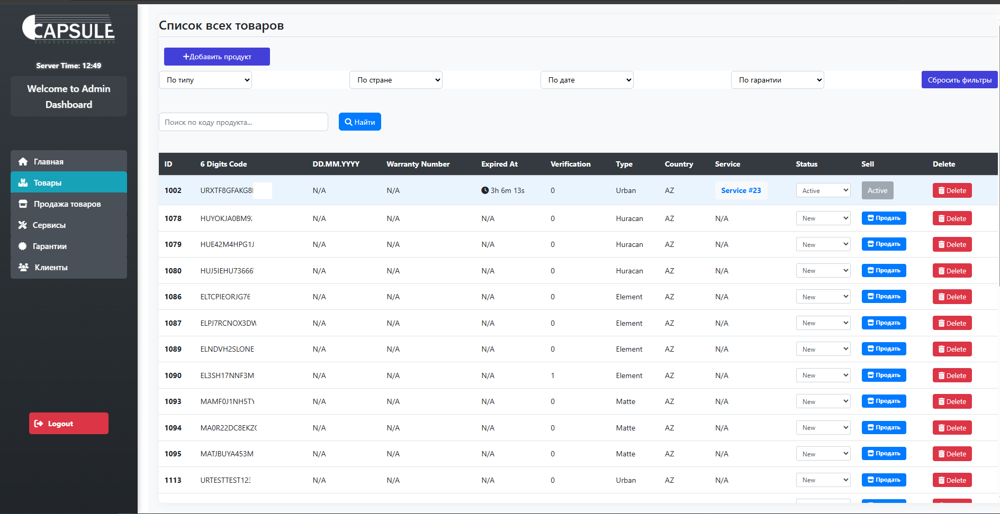
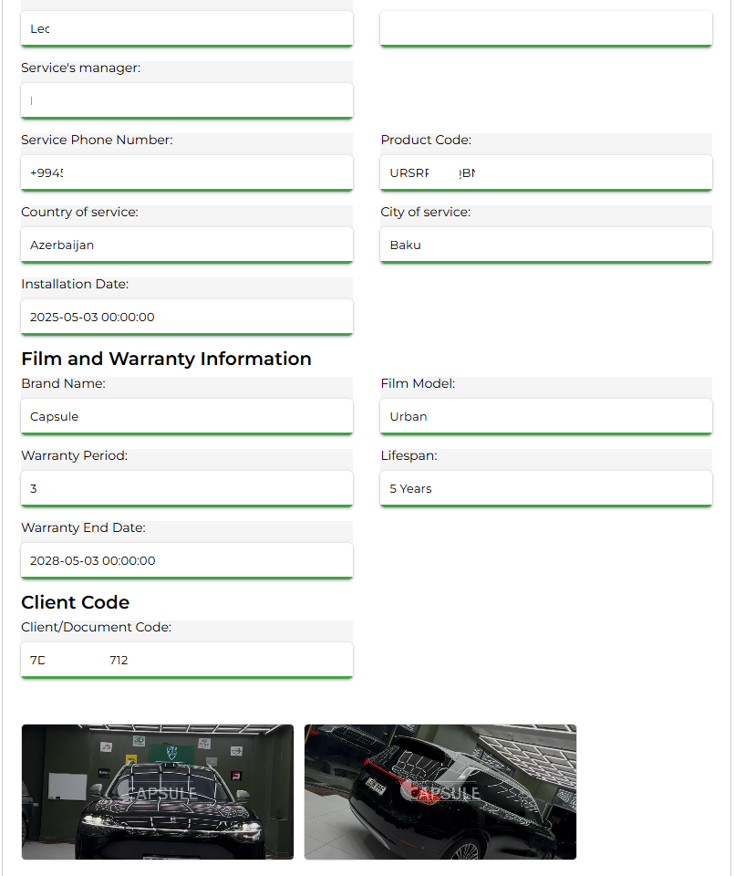
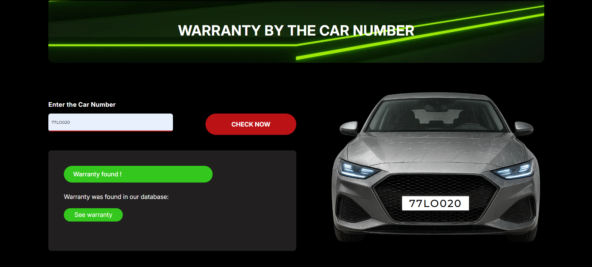
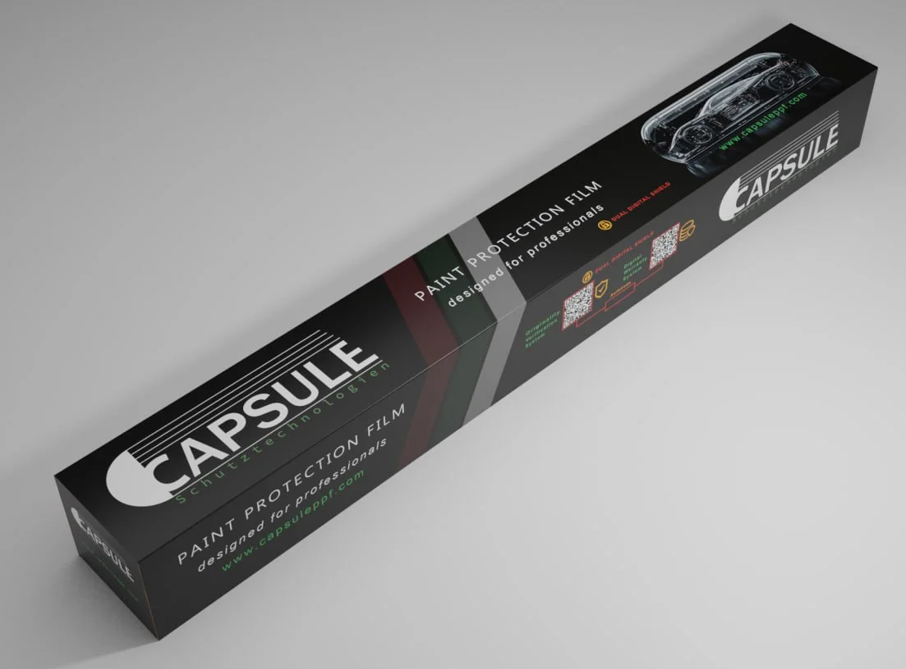

# 🛡️ Capsule PPF — Digital Paint Protection Platform

🔗 [Visit Live Site](https://capsuleppf.com/)  
🎨 UI design by [Lali Bagrationi](https://www.behance.net/ebb49210) · Built by [Daker.site](https://daker.site)
**Capsule PPF** is a production-ready Laravel-based web application built to combat counterfeit automotive paint protection films. It provides a secure, verified, and trackable system for warranty generation, product validation, and service management.

> 💡 **This project was fully developed from scratch by me — from the product architecture and security logic to the frontend implementation and backend logic.**

---

## 🧠 Real-World Use Case

At manufacturing level, each film box contains:

- 🧾 **Two QR codes**:
  1. Link for **product verification**
  2. Link for **warranty generation**

- 🔢 **One 18-digit unique product code**, encoding:
  - Film type (5 types)
  - Destination country
  - Unique product identity

---

## 🛠️ End-to-End Workflow

### 1. 📦 Product Created at Factory
- QR codes + product code are printed on the box.
- Product is **stored in the database with status: `New`**.

### 2. 🏪 Product Sold to Partner Service
- Admin marks product as "sold" in system.
- Product is now **bound to a specific car service account**.
- An SMS with **countdown timer (12–48 hours)** is sent to the service center manager.

### 3. ⏳ Time-Limited Warranty Window
- While timer is active:
  - Product status → `Active`
  - Product can be verified as **authentic** on the website.
  - Warranty **must** be issued by service center.
  
### 4. 🧾 Warranty Issuance by Service Center
- Service logs in and generates a warranty:
  - Uploads 2–3 client car photos
  - Photos are compressed and watermarked automatically
- Customer receives SMS with:
  - Link to warranty PDF
  - Personal customer code

### 5. 🔒 Final State: Expired
- Once warranty is issued (or timer expires), product:
  - Becomes `Expired`
  - Cannot be reused or reissued
  - Adds a permanent entry to verification history

---

## ✨ Key Features

- 🔐 **Digital Product Verification**
- 🕒 **Time-limited issuance window** after purchase
- 📲 **SMS-based communication with services and clients**
- 📄 **PDF Warranty Certificate generation**
- 🖼️ **Automatic image compression + watermarking**
- 🧑‍💼 **Admin Dashboard** to manage:
  - Products
  - Service centers
  - Warranties
  - Timer logic
- 🔑 **Role-based auth (Admin / Service Center)**
- 🌐 **Bilingual UI**: English + Russian
- 🚘 **Public product check by license plate number**

---

## ⚙️ Tech Stack

| Layer             | Technology                      |
|------------------|----------------------------------|
| **Backend**       | Laravel (PHP)                    |
| **Frontend**      | HTML, JavaScript, Tailwind CSS   |
| **Database**      | MySQL                            |
| **PDF Generator** | DomPDF                           |
| **SMS API**       | Integrated 3rd-party services    |
| **Authentication**| Role-based (Admin / Service)     |
| **Security**      | Timer logic, product status tracking, data binding |
| **Extras**        | Artisan CLI, Middleware, .env config, image processing, watermarking |

---

## 📸 Screenshots

### 🧑‍💼 Admin Dashboard

### 📄 Warranty Generation Form

### 🚘 Warranty Check by License Plate

### 📦 Product Box Example with QR and Product Code

