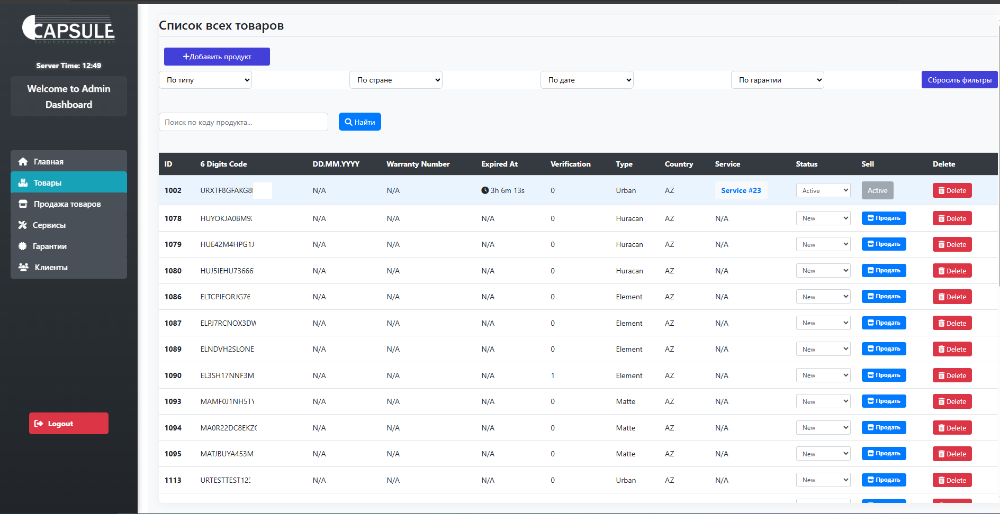
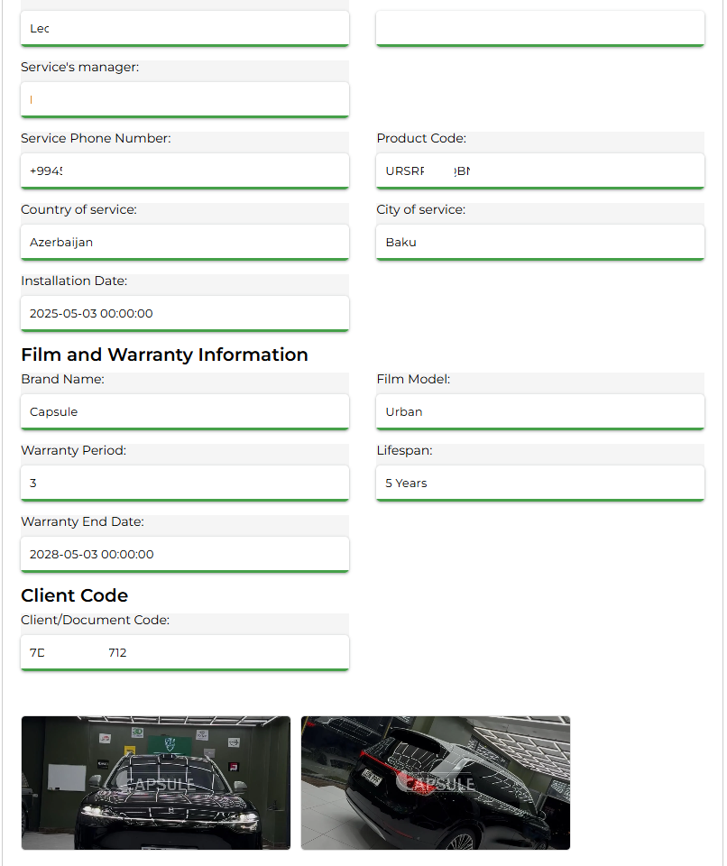
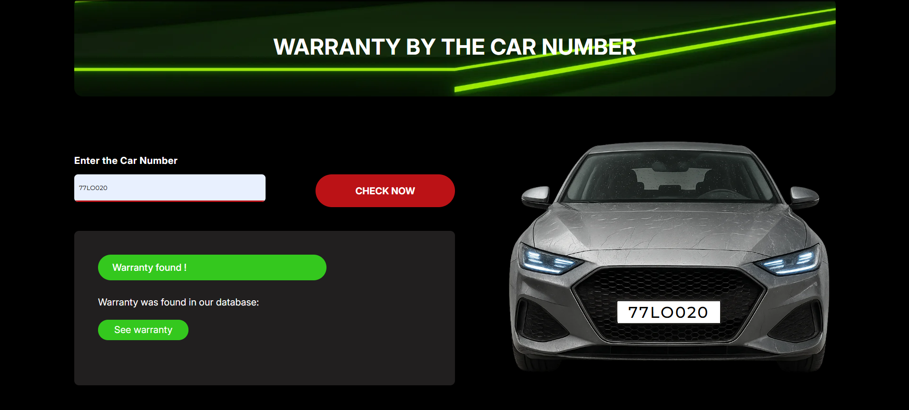
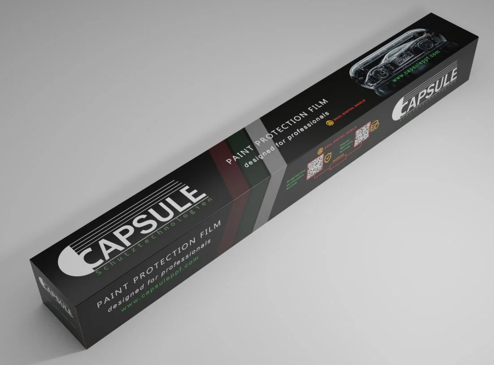

# Capsule PPF — Digital Paint Protection Platform


Production-ready Laravel web application built to combat counterfeit automotive paint protection films. It provides a secure, verified, and trackable system for warranty generation, product validation, and service management.

🔗 **Live:** [capsuleppf.com](https://capsuleppf.com/)

Developed end-to-end (product architecture, security logic, backend, and frontend) at [DAKER Studio](https://daker.site). UI design by [Lali Bagrationi](https://www.behance.net/ebb49210).

---

## Overview

At manufacturing level, each film box carries two QR codes (one for product verification, one for warranty generation) and one 18-digit unique product code encoding the film type, destination country, and product identity. The platform tracks each product through its entire lifecycle — from factory to end customer — enforcing a time-limited, non-reusable warranty process.

## End-to-End Workflow

1. **Product created at factory** — QR codes and product code printed on the box; product stored with status `New`.
2. **Product sold to partner service** — admin marks it as sold, binding it to a specific service account; an SMS with a countdown timer (12–48h) is sent to the service manager.
3. **Time-limited warranty window** — while the timer is active, the product shows as `Active` and can be verified as authentic; the warranty must be issued within the window.
4. **Warranty issuance** — the service uploads client car photos (auto-compressed and watermarked); the customer receives an SMS with a link to the warranty PDF and a personal code.
5. **Final state: Expired** — once issued or timed out, the product becomes `Expired`, cannot be reused, and a permanent entry is added to verification history.

## Key Features

- **Digital product verification** with a public check by license plate number
- **Time-limited issuance window** enforced after purchase
- **SMS-based communication** with services and clients
- **PDF warranty certificate** generation via DomPDF
- **Automatic image compression and watermarking**
- **Admin dashboard** for products, service centers, warranties, and timer logic
- **Role-based authentication** (Admin / Service Center)
- **Bilingual UI** — English and Russian

## Tech Stack

| Layer | Technology |
|-------|-----------|
| Backend | Laravel 11, PHP 8.3 |
| Frontend | Blade, Tailwind CSS, vanilla JS |
| Database | MySQL |
| PDF | DomPDF |
| Mail | Laravel Mail (SMTP) |
| Deployment | Docker, Nginx, PHP-FPM |
| Quality | Laravel Pint, GitHub Actions (CI) |

## Architecture Highlights

- **Product lifecycle state machine** — `New → Active → Expired` with time-based transitions enforced by scheduled console commands
- **Console commands** — `products:deactivate-expired` and related tasks automate timer expiry
- **Role-based middleware** — separate admin and service-center access boundaries
- **Bilingual system** — localized content via Laravel language files (en / ru)
- **Image pipeline** — client photos compressed and watermarked on upload

## Code Quality & CI

Every push runs an automated pipeline via GitHub Actions:

- **Laravel Pint** — code style enforcement
- **Migrations** — schema validation on a fresh database
- **Test suite** — automated feature and unit tests

## Running Locally

```bash
git clone https://github.com/dakerdenis/capsule-ppf.git
cd capsule-ppf/project

cp .env.example .env
# fill in your values, then:

# With Docker
docker compose up --build

# Or manually
composer install
php artisan key:generate
php artisan migrate
php artisan serve
```

## Screenshots

### Admin Dashboard


### Warranty Generation Form


### Warranty Check by License Plate


### Product Box with QR and Product Code


---

<sub>Built by [Denis Akershteyn](https://www.linkedin.com/in/denis-akershteyn) · [DAKER Studio](https://daker.site)</sub>